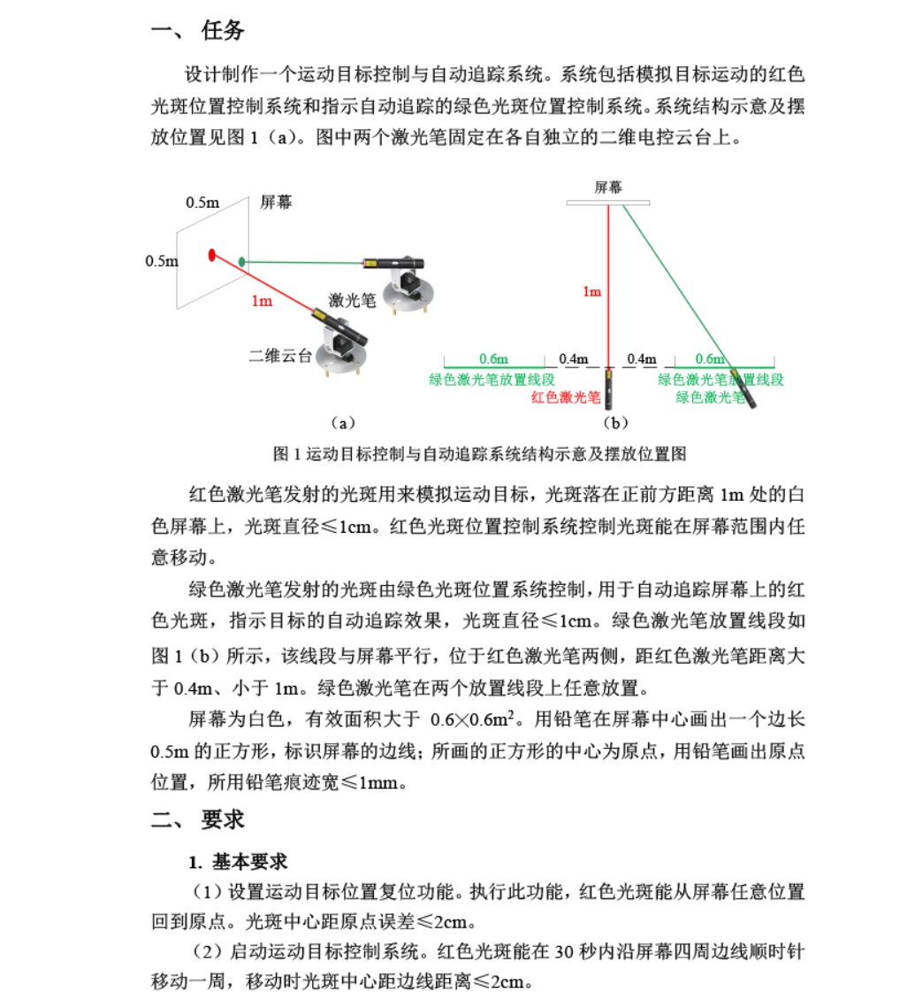
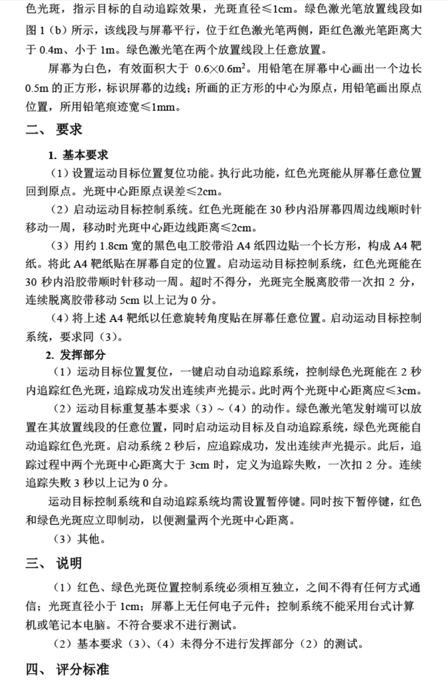

# Hongwai Laser Tracking（红外/激光视觉追踪）

南科大模电实验 / DIY 电赛题目相关：本项目面向题目“运动目标控制与自动追踪系统”，系统由**两套相互独立的视觉闭环控制系统**组成：

- **红色系统（运动目标）**：红色激光笔 + 二维云台 + 摄像头（设备A）。通过摄像头检测屏幕上的红色光斑位置，控制红色光斑按要求运动/回原点。
- **绿色系统（自动追踪）**：绿色激光笔 + 二维云台 + 摄像头（设备B）。通过摄像头检测屏幕上的红色光斑位置，控制绿色光斑追踪红色光斑。

> 题目约束通常要求两套系统**彼此独立、不得通过任何方式通信**（不能网络/串口互传坐标等）。两套系统唯一“耦合”来自屏幕上的光斑。

---

## 题目说明（截图）

> 将你提供的题目截图放在：
> - `docs/images/task-brief-1.png`
> - `docs/images/task-brief-2.png`




---

## 仓库包含的代码

目前仓库主要包含一套控制逻辑与若干视觉/标定辅助脚本（可在两套系统中复用）：

- `home/analog/workspace/shot.py`
  - 摄像头预览与采图：按 `s` 保存图片到 `img/`，按 `q` 退出。
- `home/analog/workspace/calibrate.py`
  - 棋盘格相机标定（读取 `./img/*.png`），输出相机内参和畸变系数。
- `home/analog/workspace/lab_code/controller.py`
  - pigpio 驱动舵机（GPIO: yaw=23, pitch=24）
  - 从摄像头获取图像，检测屏幕矩形/角点以及红色光斑位置，并做闭环控制。
- `home/analog/workspace/lab_code/detector/`
  - `camera.py`：摄像头封装（含去畸变参数）
  - `detector.py`：红/绿点检测、屏幕角点/矩形检测、透视变换

---

## 环境与依赖

- Python 3
- 依赖见 `requirements.txt`
- 树莓派云台控制需要：
  - `pigpio`（并需要 pigpio daemon 正常运行）
  - 舵机接线到对应 GPIO（当前代码中 yaw=23, pitch=24）

---

## 快速开始（通用：摄像头预览/采图）

```bash
cd home/analog/workspace
python shot.py
```

按键：
- `s`：保存当前帧到 `img/{idx}.png`
- `q`：退出

---

## 相机标定（通用：两套系统都可用）

1. 使用 `shot.py` 拍摄棋盘格图片，放入 `home/analog/workspace/img/`
2. 运行：

```bash
cd home/analog/workspace
python calibrate.py
```

---

## 部署说明（两套独立系统）

### 设备A：红色系统（运动目标控制）
- 连接：摄像头A、红色激光云台
- 在设备A上运行控制程序（示例）：

```bash
cd home/analog/workspace/lab_code
python controller.py
```

> 备注：当前 `controller.py` 更偏向“对准/移动到目标点”的控制逻辑。若要严格实现题目中的轨迹（回原点、沿边界运动一圈等），建议在此基础上新增“轨迹发生器/模式选择”。

### 设备B：绿色系统（自动追踪）
- 连接：摄像头B、绿色激光云台
- 运行与设备A独立的追踪控制程序（本仓库暂未提供单独入口脚本，可复用 `detector.py` 中的 `red_point/green_point` 逻辑实现追踪闭环）。

---

## 常见问题（FAQ）

### 摄像头打不开
- 尝试更换 `VideoCapture(0)` 的索引（不同设备编号不同）
- 确认没有被其它程序占用

### pigpio 不工作
- 确认在树莓派上安装并启动 pigpio daemon
- 确认 GPIO 引脚与代码一致

---

## 许可证
当前仓库未添加 LICENSE。如需开源发布，建议补充 MIT 或 Apache-2.0。
